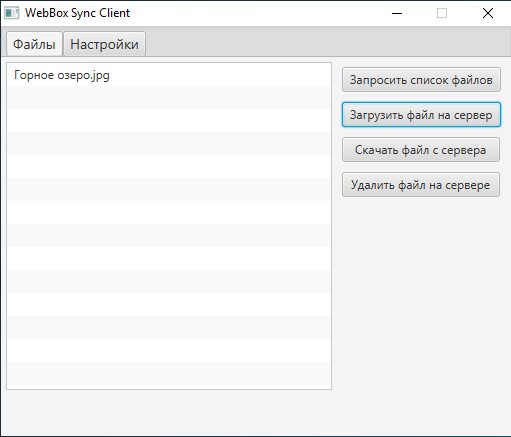
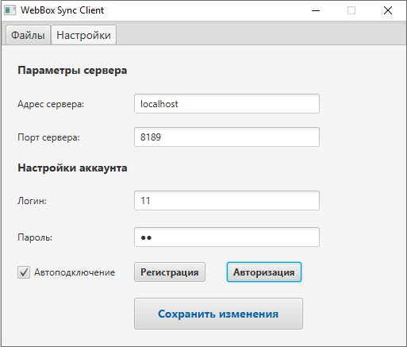

# WebBox - Cloud File Storage

Простое клиент-серверное desktop приложение для удаленного хранения файлов пользователей. 
В поставке идет свой сервер, к которому подключаются пользователи, после чего могут загружать\скачивать свои файлы. Каждый пользователь имеет доступ только к своим файлам.

<ul>
<li>Функционал приложения:
<li>Регистрация пользователя
<li>Подключение/отключение сеанса работы пользователя с сервером
<li>Запрос списка хранимых файлов
<li>Загрузка файлов на сервера
<li>Скачивание файлов с сервера
<li>Удаление файлов на сервере
</ul>

 

  &nbsp&nbsp

